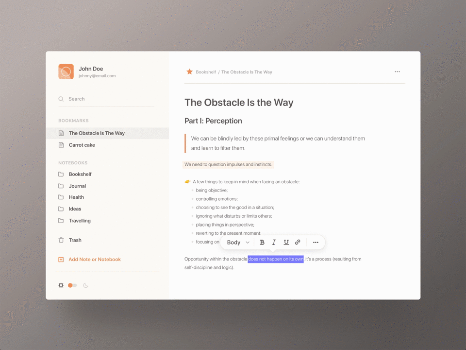

# My Notebook

React NoteBook Application for gathering thoughts and decluttering mind.

## Overview

Taking notes is a great way to make sure we keep track of our thoughts or remember the important takeaways from a meeting. Being able to easily manage them and organize them is important for finding them later!

- The first requirement of a notebook is being able to take notes. This can be pretty simple to start, where really you need some sort of input that collects what you write and stores it somewhere for later.

    Create a form to add new notes and view them in a list.

- In order to find your notes later, you want some way of organizing those notes and a way to look them up. That includes adding categories or a tagging system as well as a UI to make searches from.

    Add the ability to tag or categorize notes and an input to search through them.

- Whether we realize it or not, we can find connections between our thoughts and more importantly our notes, where we can take advantage of that network of thoughts for our notebook.

    Add Roam Research-inpsired linking of notes to create a network of thoughts.

## Technologies 
- Reach JS
- Gatsby
- Redux 
- Fuse.js
- Gatsby

## Project Goals
- Learn React Project Setup and Architecture
- Learn Reach Design Patterns
- Learn Css Structure
- Learning Reach Hooks

## Inspirations
- https://www.freecodecamp.org/news/8-reactjs-project-ideas-to-start-learning-by-doing/#notebook
- https://www.pinterest.com/pin/238831586479418377/

## COMPONENTS
- [ ] SideMenu
    - [ ] Profile
    - [ ] Search
    - [ ] List
        - [ ] Header
        - [ ] Item
    - [ ] Theme Toggle   
- [ ] Content
    - [ ] Breadcrumbs
    - [ ] Note
        - [ ] Hover Formatter 
    - [ ] Form
    - [ ] Dropdown Menu
    - [ ] Modal
 

## TODO
- [ ] List notes, notebooks, bookmarks
- [ ] Note Feature
    - [ ] Removal of note
    - [ ] Creating on new note
    - [ ] Adding tag
    - [ ] Adding bookmark
- [ ] Notebook Features
    - [ ] Removal of note book
    - [ ] Creation of new note book
    - [ ] Edit Notebook

- [ ] Other Features
    - [ ] WYSIWYG
    - [ ] Roam Searching
    - [ ] Theming
        - [ ] Dark
        - [ ] Light